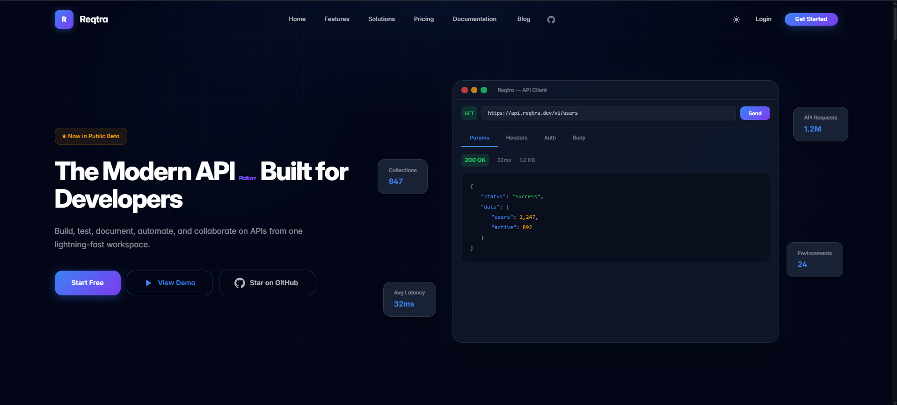
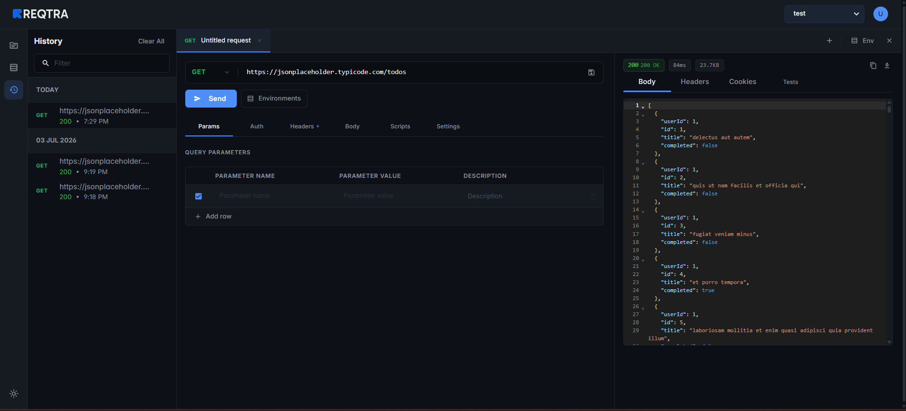
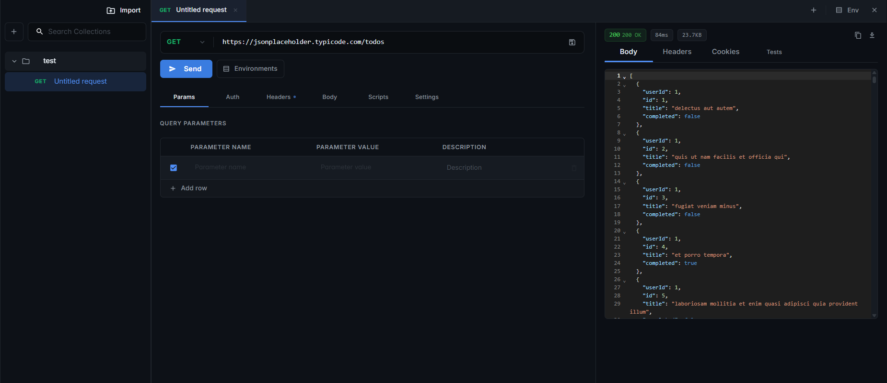

# 🚀 Reqtra

Reqtra is a modern, developer-first API collaboration and testing platform. Designed to be lightning-fast, visually premium, and highly collaborative, Reqtra lets you build, test, document, and automate your APIs in one place.



---

## ✨ Features

- **Intuitive API Client**: Build and send HTTP requests (GET, POST, PUT, DELETE, etc.) with custom parameters, headers, authentication, and request bodies.
- **Visual Request Builder**: Includes syntax highlighting using CodeMirror, supporting JSON, Javascript, and more.
- **Request History**: Automatically tracks all your executed requests so you can reuse or analyze them later.
- **Collection Management**: Group requests into collections, organize them hierarchically, and import existing collections (e.g., Postman collections).
- **Environment Variables**: Configure and switch between multiple environments (e.g., Development, Staging, Production) effortlessly.
- **Secure Authentication**: Traditional JWT register/login along with seamless OAuth integration for Google and Microsoft.
- **CORS Bypass (Proxy Server)**: Integrates an active proxy handler to route requests and circumvent browser CORS restrictions.

---

## 📸 Screenshots

### Request Builder & History
Manage parameters, headers, and view structured JSON responses alongside your request history.


### Collections Management
Organize requests in folder structures and import collections for rapid testing.


---

## 🛠️ Technology Stack

Reqtra is structured as a monorepo containing a high-performance Go backend and a modern React frontend:

### Backend ([Go](file:///d:/project/Reqtra/Backend))
- **Language**: Go (Golang)
- **Router**: Gorilla Mux
- **Database**: MongoDB (via `mongo-go-driver`)
- **Authentication**: JWT-based session security with OAuth handlers.

### Frontend ([React + Vite](file:///d:/project/Reqtra/Frontend))
- **Framework**: React 19 with Vite (fast build & HMR)
- **Styling**: Material-UI (MUI) & Custom Theme styling
- **Animations**: Framer Motion
- **Editor**: React CodeMirror

---

## 🚀 Getting Started

### Prerequisites
- [Go](https://go.dev/) (version 1.18+)
- [Node.js](https://nodejs.org/) (version 18+)
- [MongoDB](https://www.mongodb.com/) (running instance or cloud URI)

### Backend Setup

1. Navigate to the backend directory:
   ```bash
   cd Backend
   ```
2. Download Go module dependencies:
   ```bash
   go mod download
   ```
3. Create a `.env` file:
   ```env
   PORT=5000
   MONGO_URI=your_mongodb_connection_string
   DB_NAME=reqtra
   JWT_SECRET=your_jwt_secret_key
   ```
4. Run the development server:
   ```bash
   go run main.go
   ```

### Frontend Setup

1. Navigate to the frontend directory:
   ```bash
   cd Frontend
   ```
2. Install npm dependencies:
   ```bash
   npm install
   ```
3. Create a `.env` file (pointing to the backend service):
   ```env
   VITE_API_URL=http://localhost:5000
   ```
4. Run the frontend development server:
   ```bash
   npm run dev
   ```

---

## 📂 Project Directory Structure

- [Backend/](file:///d:/project/Reqtra/Backend): Holds Go backend handlers, services, and models.
- [Frontend/](file:///d:/project/Reqtra/Frontend): React 19 source code, stylesheets, and assets.
- [assets/](file:///d:/project/Reqtra/assets): Screenshots and visual assets used in documentation.
